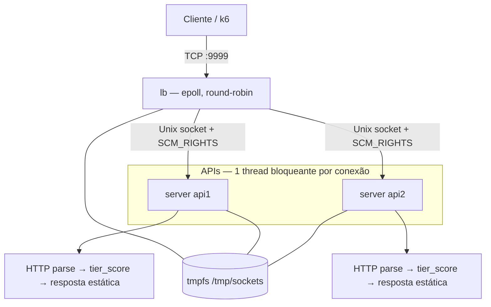
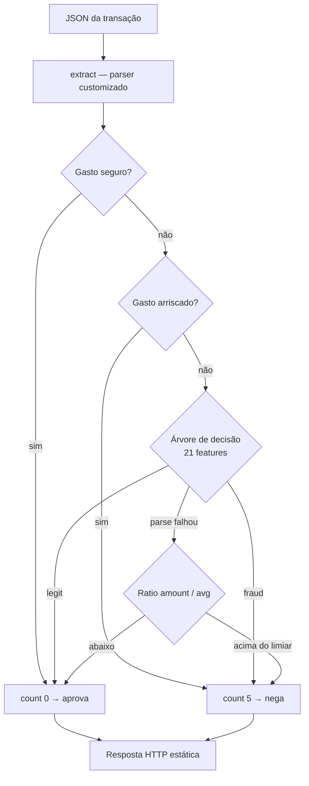
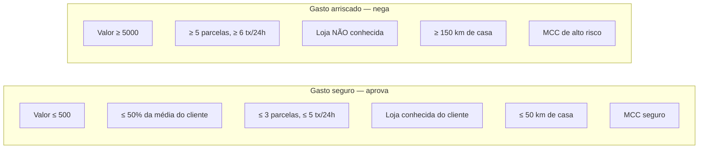
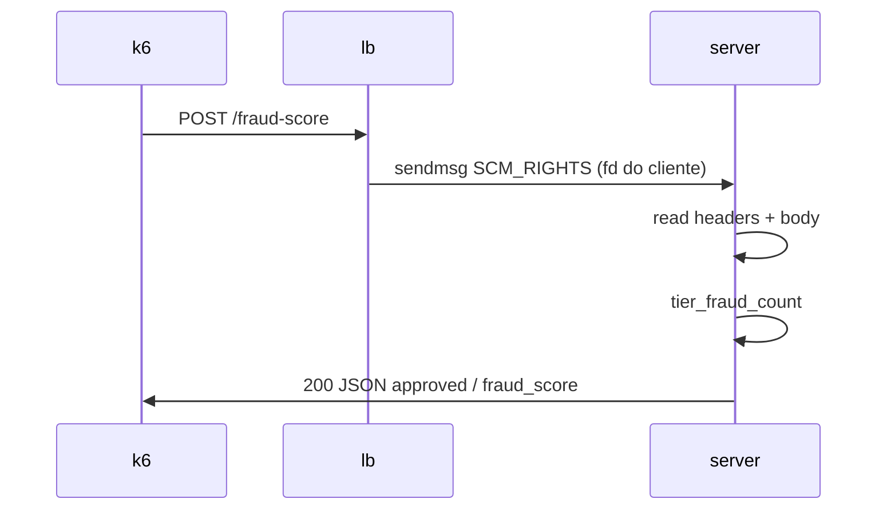
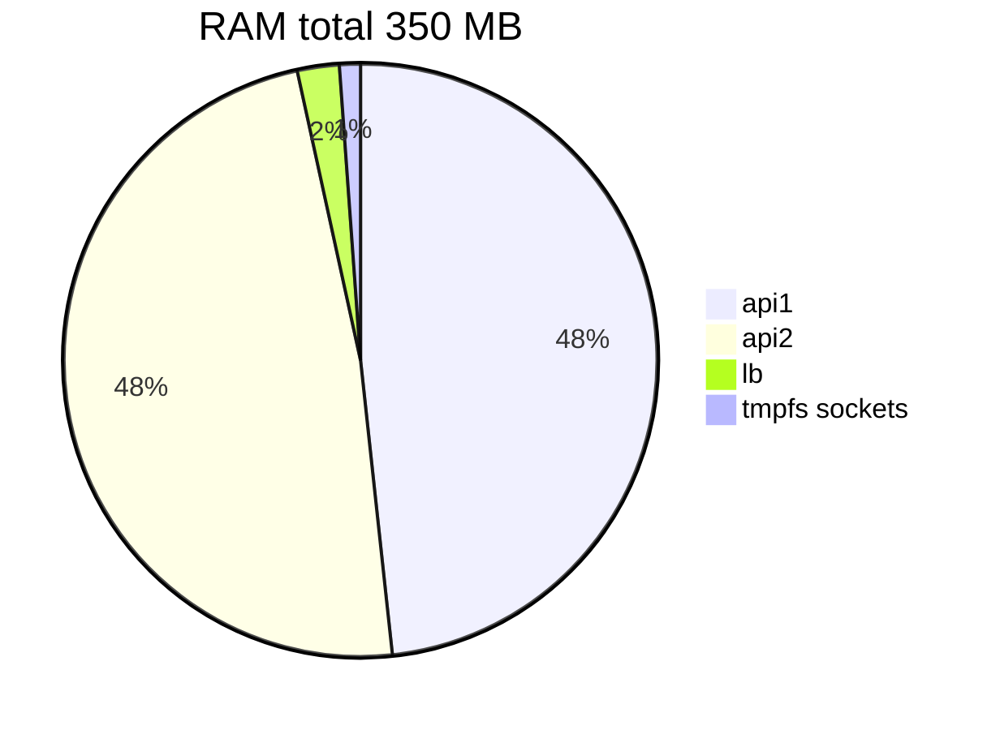

# Rinha 2026 — detecção de fraude

API em **Rust**: load balancer repassa conexões TCP para duas instâncias que classificam cada transação em **camadas** (`tier_score`: gasto seguro → gasto arriscado → árvore → ratio), sem k-NN no caminho quente.

## Arquitetura



O LB **não parseia HTTP**. Ele aceita o socket do cliente e envia o file descriptor para a API escolhida; a API lê e escreve na conexão diretamente.

## Scorer em camadas (`tier_score`)



| Camada | O que faz |
|--------|-----------|
| **Atalhos** | Gasto seguro ou arriscado — resposta imediata (ver abaixo) |
| **Árvore** | `decision_tree` — 21 features, nós gerados offline |
| **Ratio** | Fallback só com `amount` e `customer.avg_amount` |

### Gasto seguro e gasto arriscado

São **checagens rápidas** no início do `tier_score`. Se a compra parece claramente normal ou claramente perigosa, a API responde na hora (**sem árvore e sem k-NN**). Em cada caso, **todas** as condições da lista precisam ser verdadeiras.

Pense em: mercado perto de casa vs. compra cara, longe, em loja desconhecida e de alto risco.



#### **Gasto seguro** (aprova, `count = 0`)

Perfil de gasto **baixo, habitual e em contexto seguro**:

| Campo | Condição | Intuição |
|-------|----------|----------|
| `transaction.amount` | ≤ **500** | Compra modesta |
| `amount / customer.avg_amount` | ≤ **0,50001** | Não é um pico em relação ao histórico |
| `installments` | ≤ **3** | Poucas parcelas |
| `customer.tx_count_24h` | ≤ **5** | Pouca atividade no dia |
| `merchant.id` | está em `known_merchants` | Cliente já compra nessa loja |
| `terminal.km_from_home` | ≤ **50** | Perto de “casa” |
| `merchant.mcc` | **5411**, **5812**, **5912** ou **5311** | Supermercado, restaurante, farmácia, varejo “comum” |

Exemplo mental: R$ 80 no mercado da esquina, 2x, 2 compras no dia, loja já conhecida, 10 km de casa, MCC supermercado.

#### **Gasto arriscado** (nega, `count = 5`)

Perfil de gasto **alto, agressivo e em contexto de risco**:

| Campo | Condição | Intuição |
|-------|----------|----------|
| `transaction.amount` | ≥ **5000** | Valor alto |
| `installments` | ≥ **5** | Muitas parcelas |
| `customer.tx_count_24h` | ≥ **6** | Muitas transações no dia |
| `merchant.id` | **não** está em `known_merchants` | Loja nunca vista pelo cliente |
| `terminal.km_from_home` | ≥ **150** | Longe de casa |
| `merchant.mcc` | **7995**, **7801** ou **7802** | Apostas / serviços financeiros de risco |

Exemplo mental: R$ 8.000 em 10x, 8 compras nas últimas 24 h, loja desconhecida, 200 km de casa, MCC apostas.

#### O que fica de fora?

Tudo que **não** cai nas duas caixas acima segue para a **árvore** (casos “cinza”: valor médio, MCC neutro, loja nova mas perto, etc.). Se faltar dado para montar as 21 features (ex.: timestamp inválido), cai no **ratio** `amount / avg_amount`.

Implementação: `src/search/tier_score.rs` (`obvious_legit`, `obvious_fraud`).

Validação offline:

```bash
cargo run --release --bin verify-tier -- test/test-data.json
```

## Fluxo de um request



## Rodar

```bash
docker compose up --build -d
```

Benchmark: [test/README.md](test/README.md) (rede do container do LB).

```bash
docker run --rm --user root --network container:rinha2026-lb-1 \
  -e BASE_URL=http://127.0.0.1:9999 \
  -v "$(pwd)/test:/test" -w /test \
  grafana/k6:latest run test.js
```

## Limites Docker (prova)



| Serviço | CPU | RAM |
|---------|-----|-----|
| lb | 0,10 | 8 MB |
| api1 / api2 | 0,45 | 169 MB cada |
| volume tmpfs | — | 4 MB |

## Variáveis

| Variável | Serviço | Descrição |
|----------|---------|-----------|
| `LB_PORT` | lb | Porta pública (9999) |
| `API1_SOCKET` / `API2_SOCKET` | lb | Upstreams Unix |
| `CTRL_SOCK` | api | Socket FD-pass |
| `FD_PASS=1` | api | Ativa modo FD-pass |
| `INDEX_PATH` | api | Índice mmap (boot / healthcheck) |
| `PORT` | api | Healthcheck TCP |

## Build do índice (tooling)

Runtime usa `tier_score`; `build-index` gera `data/index.bin` para healthcheck e ferramentas legadas:

```bash
cargo run --release --bin build-index -- resources data/index.bin
```

## Versão em C

[VERSAO-c/README.md](VERSAO-c/README.md) — mesma arquitetura e scorer, implementação C11.
