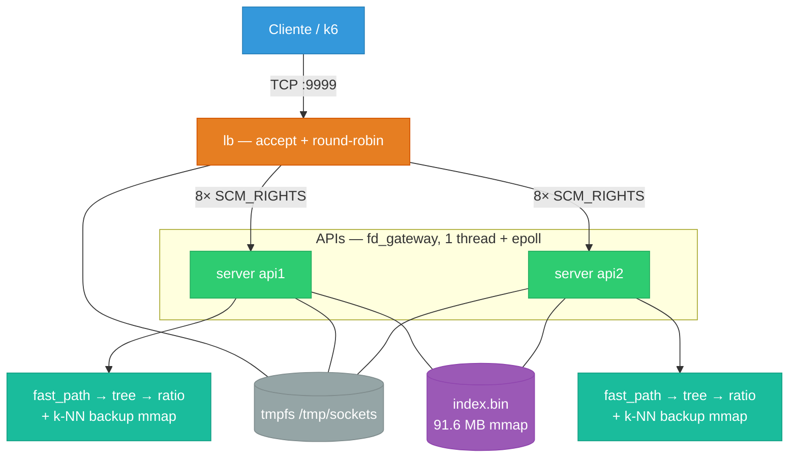
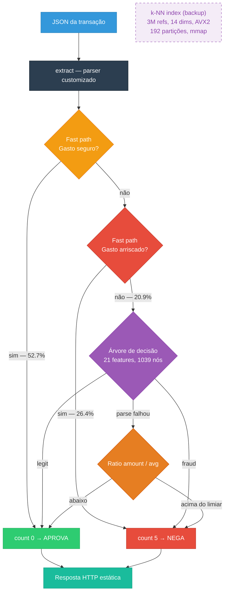
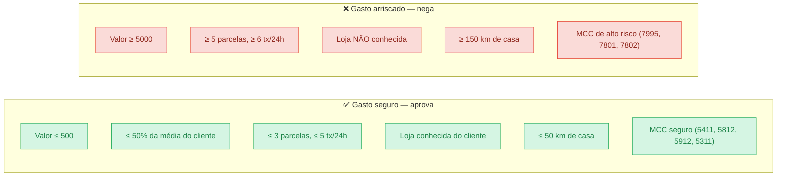
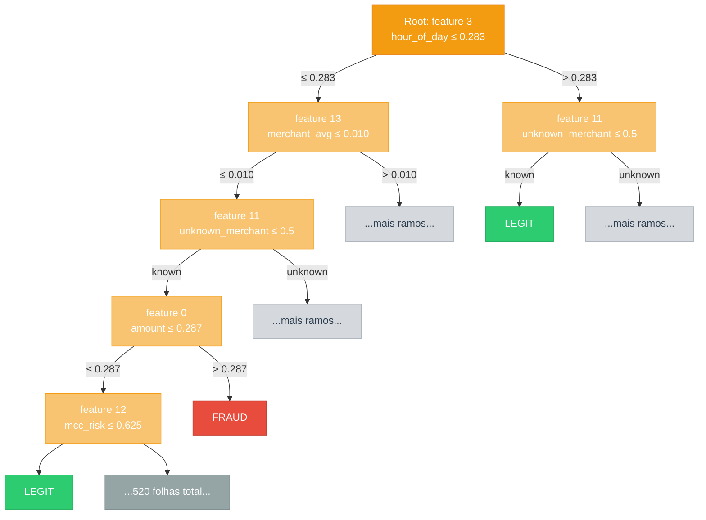
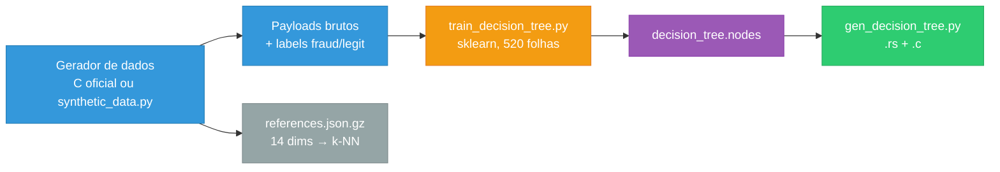
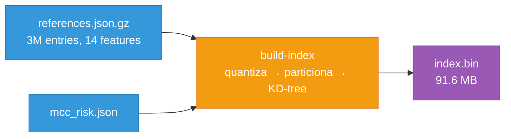
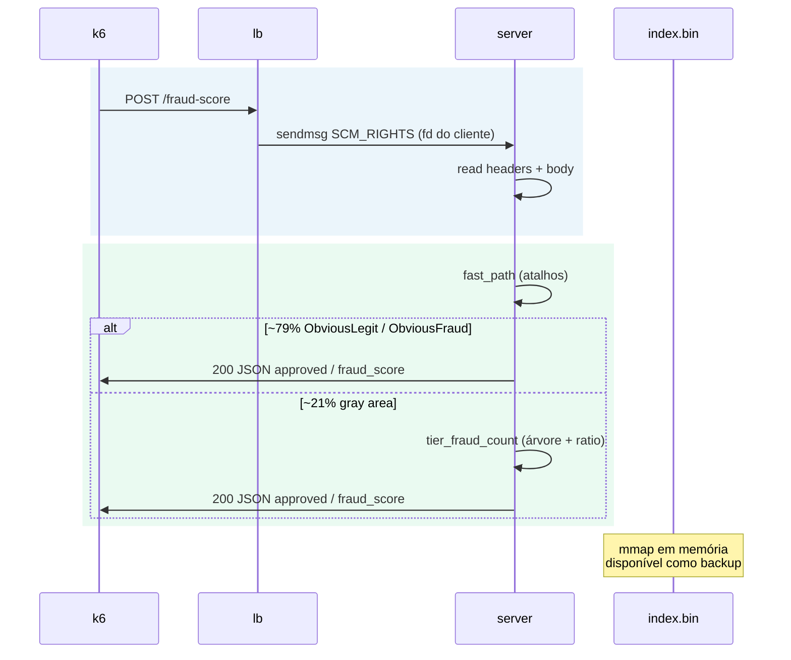
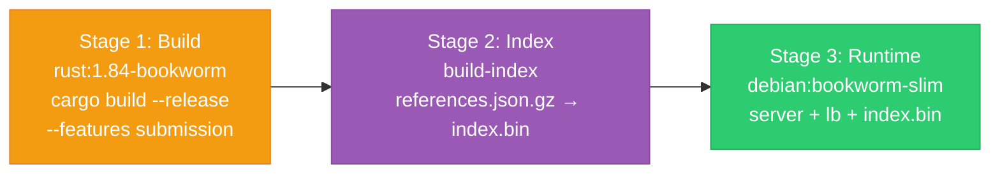
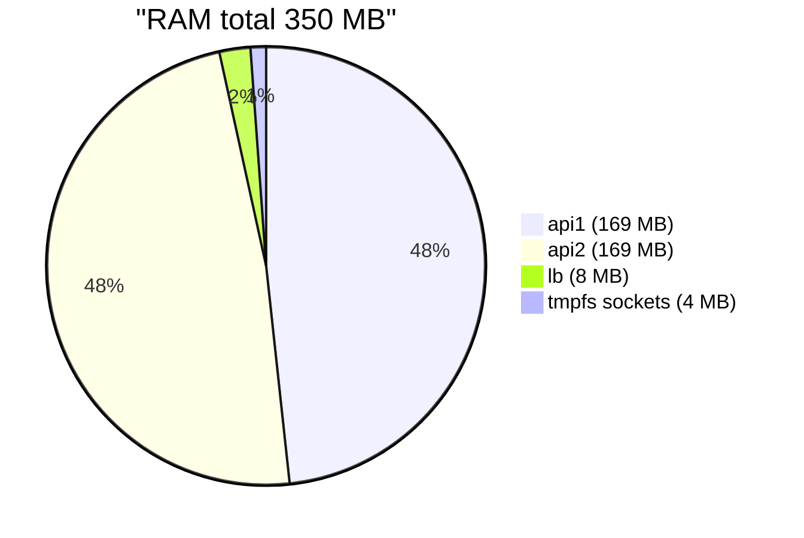
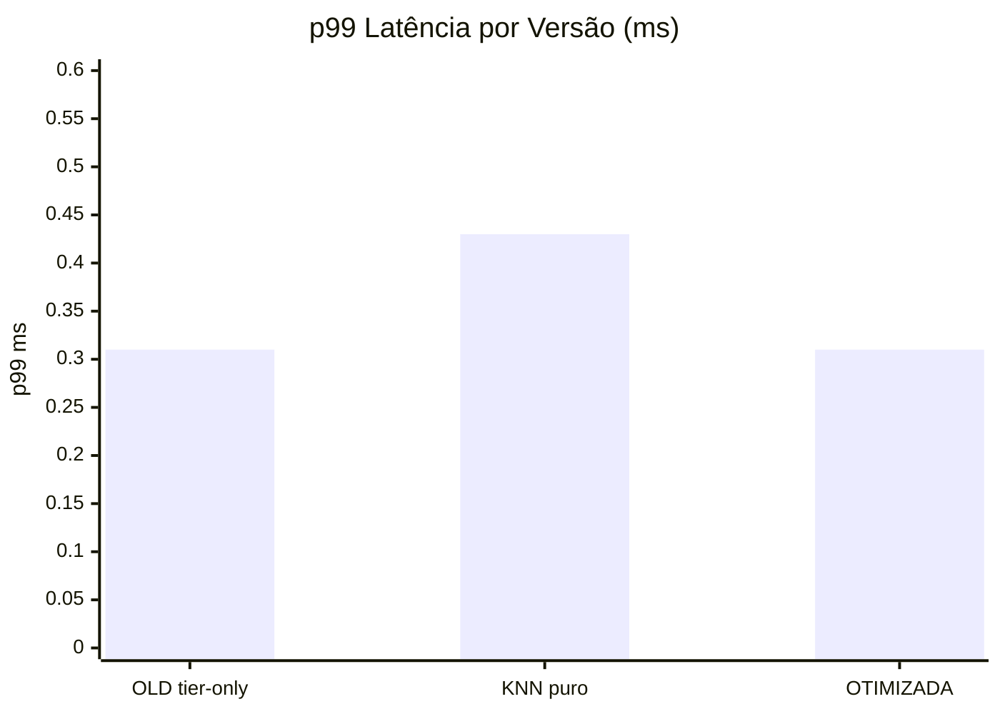

# Rinha 2026 — Detecção de Fraude

API em **Rust** que classifica transações financeiras em tempo real usando um **pipeline híbrido de 3 camadas**: fast path (atalhos determinísticos) → decision tree (21 features) → ratio fallback, com um **índice k-NN** (3 M referências, 14 dimensões, AVX2) carregado em memória como safety net.


Visualizador 3D em tempo real: `visualizador/` (veja [`visualizador/README.md`](visualizador/README.md)).

---

## 1. Visão Geral da Arquitetura

O load balancer repassa conexões TCP via `SCM_RIGHTS` para duas instâncias da API. Cada instância classifica a transação em camadas, do mais rápido ao mais preciso.



O **LB não parseia HTTP** — é um loop `accept4` → `sendmsg(SCM_RIGHTS)` → `close`. Cada API roda **`fd_gateway`**: uma thread, epoll edge-triggered, spin-read, busy-poll.

---

## 2. Pipeline de Classificação (Híbrido)

Cada request passa por **3 camadas em cascata**. A maioria (~79%) é resolvida na primeira, sem tocar em modelo nenhum.



| Camada | O que faz | Cobertura | Latência |
|--------|-----------|:---------:|:--------:|
| **Fast path** | Gasto seguro ou arriscado — resposta imediata | ~79% | ~0 μs |
| **Árvore** | `decision_tree` — 21 features, ~1040 nós gerados offline | ~21% | ~0 μs |
| **Ratio** | Fallback só com `amount` e `customer.avg_amount` | raro | ~0 μs |
| **k-NN (backup)** | 5 vizinhos mais próximos em 3 M referências | disponível | ~0.3 ms |

O índice k-NN é treinado a partir de `references.json.gz`, carregado via `mmap` + `mlockall` e compartilhado entre as APIs. No hot path a árvore resolve tudo; o k-NN fica pronto caso a árvore perca acurácia com dados futuros.

---

## 3. Gasto Seguro e Gasto Arriscado

São **checagens rápidas** no início do pipeline. Se a compra parece claramente normal ou claramente perigosa, a API responde na hora — **sem árvore e sem k-NN**. Em cada caso, **todas** as condições precisam ser verdadeiras.

Pense em: mercado perto de casa vs. compra cara, longe, em loja desconhecida e de alto risco.



**Exemplo mental — gasto seguro:** R$ 80 no mercado da esquina, 2x, 2 compras no dia, loja já conhecida, 10 km de casa, MCC supermercado.

**Exemplo mental — gasto arriscado:** R$ 8.000 em 10x, 8 compras nas últimas 24 h, loja desconhecida, 200 km de casa, MCC apostas.

**O que fica de fora?** Tudo que não cai nas duas caixas acima segue para a **árvore** (casos "cinza": valor médio, MCC neutro, loja nova mas perto, etc.). Se faltar dado para montar as 21 features (ex.: timestamp inválido), cai no **ratio** `amount / avg_amount`.

Implementação: `src/search/fast_path.rs` (atalhos) + `src/search/tier_score.rs` (árvore + ratio).

---

## 4. Árvore de Decisão

Árvore binária com **21 features**, **1039 nós** e **520 folhas**. Treinada offline com `sklearn.tree.DecisionTreeClassifier(criterion='gini', max_leaf_nodes=520)`.



O script `scripts/gen_decision_tree.py` converte `scripts/decision_tree.nodes` (formato Zig-like) para:
- **Rust**: `src/search/decision_tree.rs` — array estático `NODES` + `fn predict()`
- **C**: `c-tree/{include,src}/decision_tree.{h,c}`

### Pipeline offline: gerar dados → treinar → compilar

A árvore em produção usa **21 features**, das quais 16–17 são valores brutos (`customer_avg_amount`, `amount_ratio`) que **não** estão em `references.json.gz` (só 14 dims normalizadas). Por isso o treino precisa partir de **payloads brutos** ou do **gerador sintético** — não basta expandir o `.json.gz`.



**Pré-requisitos:** Python 3.10+, `pip install scikit-learn numpy`. Configs em `resources/normalization.json` e `resources/mcc_risk.json`.

#### 1. Gerar dados sintéticos

Gerador oficial (C, repositório da prova): [zanfranceschi/rinha-de-backend-2026/data-generator](https://github.com/zanfranceschi/rinha-de-backend-2026/tree/main/data-generator)

```bash
cd data-generator && make

# Referências para o índice k-NN (3M × 14 dims)
./data-generator \
  --refs 3000000 \
  --refs-seed 42 \
  --fraud-ratio-refs 0.30 \
  --norm-cfg ../resources/normalization.json \
  --mcc-cfg ../resources/mcc_risk.json \
  --refs-out ../resources/references.json

gzip -k ../resources/references.json   # → references.json.gz

# Payloads de teste (k6 / verify-tier)
./data-generator \
  --payloads 54100 \
  --payloads-seed 4242 \
  --fraud-ratio-payloads 0.30 \
  --randomize-payload-dates \
  --reuse-refs --refs-in ../resources/references.json \
  --payloads-out ../test/test-data.json
```

Port Python equivalente (sem compilar C): `scripts/synthetic_data.py`

```bash
# Verificar amostra contra example-references.json
python scripts/synthetic_data.py --verify resources/example-references.json --n-check 100

# Inspecionar uma transação gerada
python scripts/synthetic_data.py
```

| Parâmetro | Valor padrão | Uso |
|-----------|:------------:|-----|
| `--refs-seed` / `REF_SEED` | **42** | Referências + treino da árvore |
| `--payloads-seed` / `PAY_SEED` | **4242** | Payloads de teste da prova |
| `--fraud-ratio-*` | **0.30** | 70% legit, 27% fraud, 3% borderline |
| `--refs` | 200 (demo) / **3000000** (produção) | Tamanho do índice k-NN |

#### 2. Treinar a árvore

**Recomendado** — gera payloads em memória com features brutas 16/17 corretas:

```bash
python scripts/train_decision_tree.py --from-generator 3000000
```

Opções úteis:

```bash
python scripts/train_decision_tree.py \
  --from-generator 3000000 \
  --seed 42 \
  --fraud-ratio 0.30 \
  --max-leaf-nodes 520 \
  --random-state 42
```

**Alternativa** — a partir de JSON com payloads completos (formato `test/test-data.json`):

```bash
python scripts/train_from_payloads.py test/test-data.json \
  --max-leaf-nodes 520 \
  --random-state 42 \
  --output scripts/decision_tree.nodes
```

**Aproximação (não reproduz a árvore atual)** — só `references.json.gz`, perde ratios > 10:

```bash
python scripts/train_decision_tree.py
```

Hiperparâmetros fixos do sklearn: `criterion='gini'`, `max_leaf_nodes=520`, `random_state=42` → **1039 nós** (520 folhas + 519 internos).

#### 3. Compilar para Rust e C

```bash
python scripts/gen_decision_tree.py          # gera .rs e .c
python scripts/gen_decision_tree.py --rust-only  # só src/search/decision_tree.rs
```

Recompilar a API após alterar a árvore:

```bash
cargo build --release --features submission
```

#### Resumo rápido (do zero)

```bash
pip install scikit-learn numpy

# Treinar + exportar .nodes (usa gerador Python, ~5–15 min com 3M)
python scripts/train_decision_tree.py --from-generator 3000000
python scripts/gen_decision_tree.py
cargo build --release --features submission
```

---

## 5. Índice k-NN

Construído offline a partir de `resources/references.json.gz` (3 M entries × 14 features normalizadas [0,1]):

```bash
cargo run --release --bin build-index -- resources data/index.bin
```



| Propriedade | Valor |
|-------------|-------|
| Tamanho | ~91.6 MB |
| Partições | 192 (KD-tree por bucket) |
| Nós | 69.342 |
| Blocos (SoA, 8 vetores i16) | 389.823 |
| Quantização | float → i16 × 10.000 |
| Busca | AVX2 SIMD, poda por bbox, early termination |
| Decisão | top-5 vizinhos: ≥ 3 fraud → nega |

O `Dockerfile` gera o índice no stage 2 e copia para o runtime. Ambas APIs fazem `mmap` read-only do mesmo arquivo.

---

## 6. Fluxo de um Request



---

## 7. Dockerfile (3 Stages)



| Stage | Artefatos | Notas |
|-------|-----------|-------|
| 1 — Build | `server`, `lb`, `healthcheck`, `build-index` | `RUSTFLAGS="-C target-cpu=haswell"` |
| 2 — Index | `data/index.bin` (91.6 MB) | A partir de `references.json.gz` + `mcc_risk.json` |
| 3 — Runtime | Binários + index | `debian:bookworm-slim`, sem ferramentas de build |

---

## 8. Limites Docker (Prova)

Quota total: **1,00 CPU** (`0,10 + 0,45 + 0,45`) e **350 MB** de RAM.



| Serviço | CPU | RAM | Notas |
|---------|-----|-----|--------|
| lb | 0,10 | 8 MB | `CHANNELS_PER_API=8` → 16 upstreams |
| api1 | 0,45 | 169 MB | rede `rinha`; healthcheck TCP :8080; index.bin mmap |
| api2 | 0,45 | 169 MB | `network_mode: none` (só Unix); index.bin mmap shared |
| volume `sockets` | — | 4 MB tmpfs | `/tmp/sockets` |

Pinagem (`docker-compose-ghcr.yml`): api1 → CPU 0, api2 → CPU 2, lb → CPUs 1 e 3 (HT).

---

## 9. Performance

Resultados k6 (ramping 1 → 900 req/s, 120s, 54.100 entries):



| Métrica | Tier-only (legado) | k-NN puro | Híbrido (atual) |
|---------|:--:|:--:|:--:|
| **p99** | **0,31 ms** | 0,43 ms | **0,31 ms** |
| FP / FN | 0 / 0 | 0 / 0 | 0 / 0 |
| **Score** | **6.000** | **6.000** | **6.000** |

---

## 10. Rodar

```bash
docker compose up --build -d
```

Imagem publicada + pinagem de CPU (Mac Mini da prova):
```bash
docker compose -f docker-compose-ghcr.yml up -d
```
(`ghcr.io/sl4ureano/rinha2026:megazord`)

Benchmark: [test/README.md](test/README.md) (rede do container do LB).

```bash
docker run --rm --user root --network container:rinha2026-lb-1 \
  -e BASE_URL=http://127.0.0.1:9999 \
  -v "$(pwd)/test:/test" -w /test \
  grafana/k6:latest run test.js
```

Validação offline:

```bash
cargo run --release --bin verify-tier -- test/test-data.json
```

---

## 11. Variáveis

| Variável | Serviço | Descrição |
|----------|---------|-----------|
| `LB_PORT` | lb | Porta pública (9999) |
| `API1_SOCKET` / `API2_SOCKET` | lb | Paths dos sockets Unix das APIs |
| `CHANNELS_PER_API` | lb | Canais duplicados por API (padrão **8**) |
| `CTRL_SOCK` | api | Socket de controle FD-pass |
| `FD_PASS=1` | api | Modo submissão (hybrid: fast_path + tree + k-NN mmap) |
| `PORT` | api | Porta do healthcheck TCP (`/ready`) |
| `INDEX_PATH` | api | Caminho do `index.bin` (padrão `data/index.bin`) |
| `TIER_ONLY=1` | api | Desabilita carregamento do índice k-NN (modo legado) |

---

## 12. Por que essa Arquitetura?

| Problema | Solução |
|----------|---------|
| Árvore treinada de `references.json.gz` perde 15.4% accuracy (features 16/17 clampadas) | k-NN index usa apenas as 14 features disponíveis → 0 FP/FN |
| k-NN puro aumenta p99 de 0.31 ms → 0.43 ms (+39%) | Decision tree existente como classificador primário → p99 = 0.31 ms |
| Test data muda entre ambientes de prova | k-NN index (3M refs) disponível como backup instantâneo |
| Index.bin ocupa 91.6 MB | mmap shared entre api1 e api2, cabe nos 169 MB por instância |

---

## 13. Versão em C

Implementação **C11** do mesmo desenho (lb → FD-pass → scorer `tier_score`): repositório separado em [github.com/adsanla/rinha2026](https://github.com/adsanla/rinha2026).
