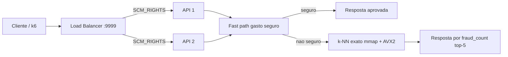
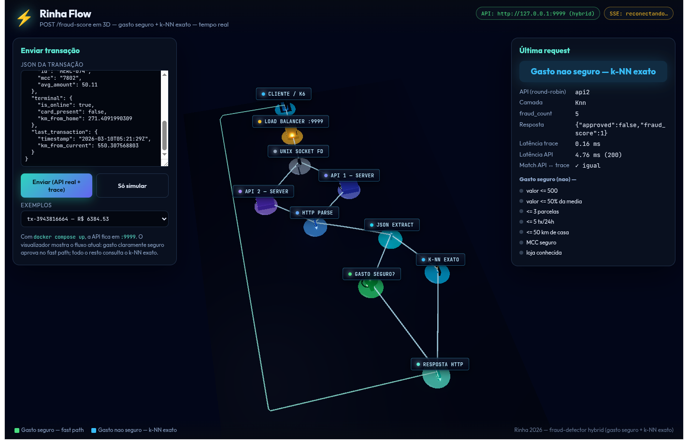
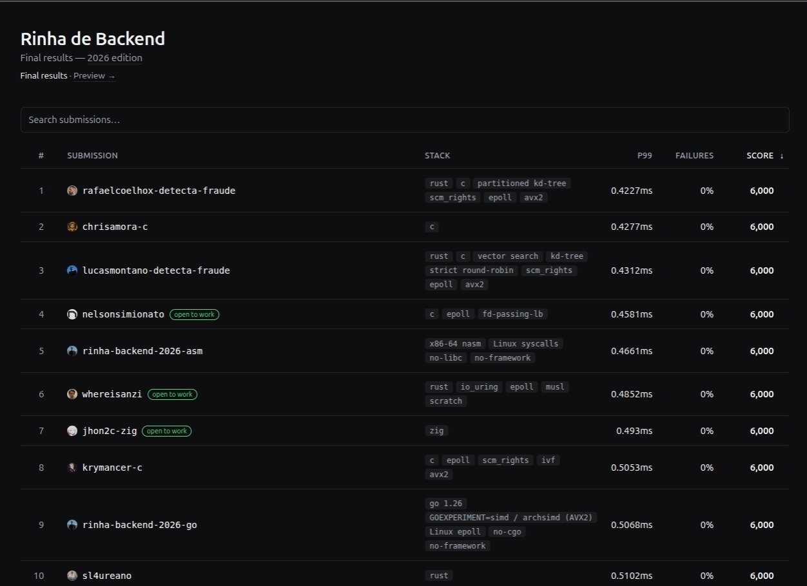

# Rinha 2026 Fraud Detector

API em Rust para classificar transações financeiras em tempo real. O fluxo atual tem dois caminhos:

1. **Gasto seguro**: regras conservadoras aprovam rapidamente compras claramente normais.
2. **Gasto não seguro**: todo o restante é vetorizado e consultado no **k-NN exato**.

Não há lookup por respostas esperadas e não há fallback heurístico para negar transações. A decisão dos casos não seguros vem do índice vetorial.

## Arquitetura


```mermaid
flowchart LR
    C[Cliente / k6] --> LB[Load Balancer :9999]
    LB -->|SCM_RIGHTS| A1[API 1]
    LB -->|SCM_RIGHTS| A2[API 2]
    A1 --> S[Fast path gasto seguro]
    A2 --> S
    S -->|seguro| OK[Resposta aprovada]
    S -->|nao seguro| KNN[k-NN exato mmap + AVX2]
    KNN --> R[Resposta por fraud_count top-5]
```

## Fluxo De Classificacao

### 1. Gasto Seguro

Implementado em `src/search/fast_path.rs`.

A API aprova no fast path somente quando todas as condições conservadoras passam:

- valor `<= 500`
- valor `<= 50%` da média do cliente
- parcelas `<= 3`
- transações em 24h `<= 5`
- distância de casa `<= 50 km`
- loja conhecida
- MCC seguro: `5411`, `5812`, `5912`, `5311`

Esse caminho retorna `fraud_count = 0`.

### 2. Gasto Nao Seguro

Qualquer transação que falha em pelo menos uma condição acima cai no k-NN exato:

- `extract` parseia o JSON sem alocação no hot path.
- `vectorize_payload` transforma o payload nas 14 dimensões quantizadas.
- `fraud_count` busca os 5 vizinhos exatos no índice particionado.
- A resposta vem da soma dos labels dos top-5 vizinhos.

Mapa de resposta:

| fraud_count | approved | fraud_score |
| ---: | :---: | ---: |
| 0 | true | 0.0 |
| 1 | true | 0.2 |
| 2 | true | 0.4 |
| 3 | false | 0.6 |
| 4 | false | 0.8 |
| 5 | false | 1.0 |

## Indice k-NN

O índice é gerado offline a partir das referências e carregado por `mmap` no início da API.

Características principais:

- vetores quantizados em `i16`
- 14 dimensões
- partições por chave vetorial
- KD-tree por partição
- folhas em blocos SoA
- busca AVX2 no caminho de produção
- poda por bounding box e máscara de labels por nó

Arquivos principais:

- `src/index/quantize.rs`: layout, quantização e headers do índice.
- `src/build/pack.rs`: construção das partições e KD-trees.
- `src/search/knn.rs`: busca exata dos top-5 vizinhos.
- `src/search/warmup.rs`: aquecimento do k-NN antes de aceitar tráfego.

## Runtime

O modo de submissão usa:

- `lb`: aceita TCP em `:9999` e passa o fd para as APIs por Unix socket.
- `api1` e `api2`: recebem fd via `SCM_RIGHTS`, fazem parse, fast path e k-NN.
O modo de submissão é fixo: gasto seguro no fast path; não seguro no k-NN.
O `docker-compose.yml` não injeta variáveis de ambiente no runtime; portas, sockets, índice e warmup ficam definidos no código.

Recursos atuais no `docker-compose.yml`:

| Container | CPU | Memoria |
| --- | ---: | ---: |
| lb | `0.20` | `48M` |
| api1 | `0.40` | `151M` |
| api2 | `0.40` | `151M` |

## Comandos Uteis

Build/check:

```bash
cargo check --no-default-features --features submission
```

Gerar índice:

```bash
cargo run --release --bin build-index -- resources/references.json.gz resources/index.bin
```

Validar fast path contra k-NN:

```bash
cargo run --release --bin verify-fast -- test/test-data.json
```

Verificar caminho quente do k-NN:

```bash
cargo run --release --bin verify-knn-hot -- test/test-data.json
```

Subir a submissão local:

```bash
docker compose up --build
```

## Visualizador



O visualizador em `visualizador/` mostra o fluxo atual:

- cliente → load balancer → fd pass → API
- parse HTTP/JSON
- checagem de gasto seguro
- k-NN exato quando não é seguro
- resposta final

```bash
cd visualizador
npm install
npm start
```

Por padrão ele chama `http://127.0.0.1:9999`.


### Resultado Final Rinha 2026


