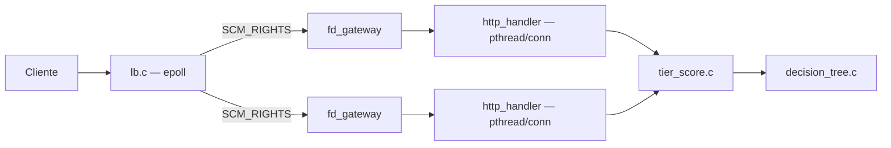
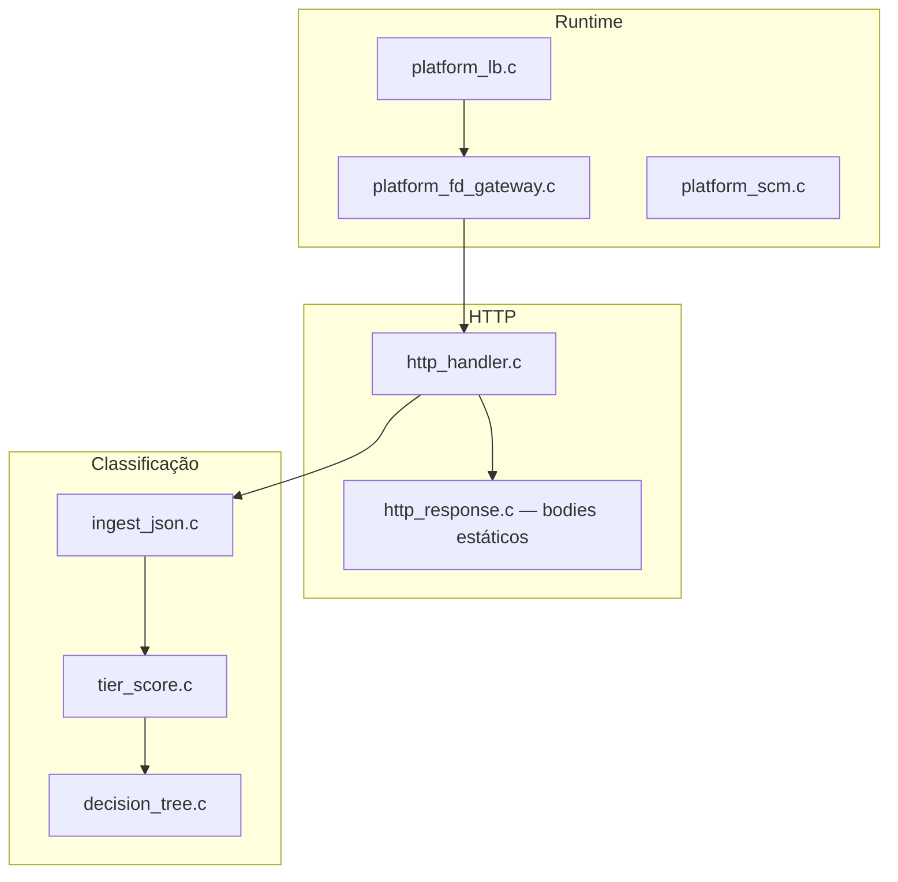
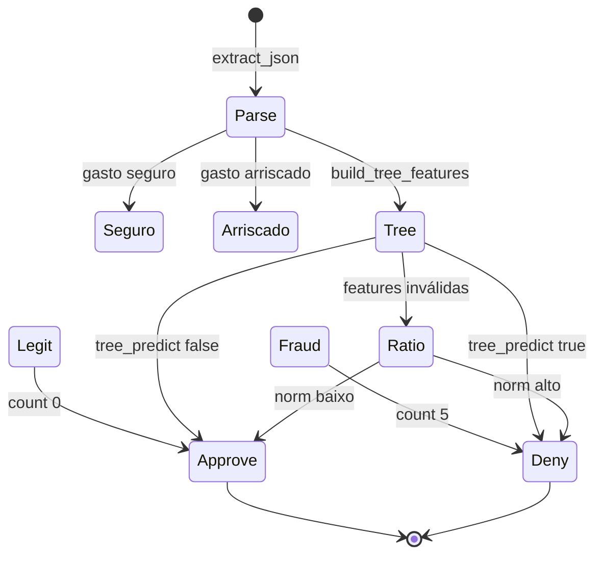
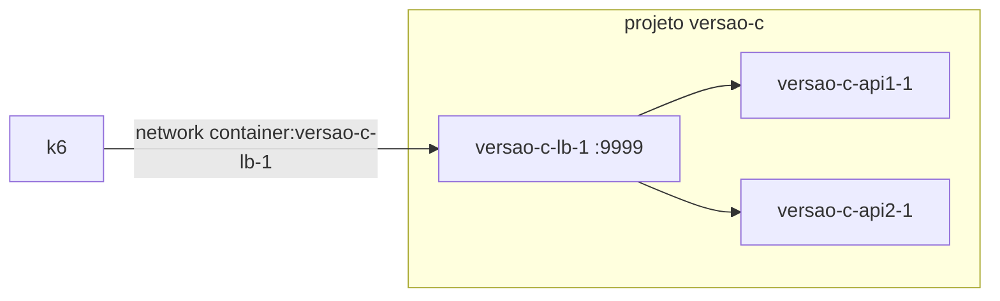

# VERSAO-c

Implementação **C11** do mesmo desenho da raiz: `lb` (epoll) → FD-pass → 2× `server`, scorer `tier_score` (gasto seguro → gasto arriscado → árvore → ratio).

## Arquitetura



## Módulos



## Scorer (`tier_score`)

Mesma lógica da versão Rust.

**Atalhos** (antes da árvore):

- **Gasto seguro:** valor ≤ 500, ≤ 50% da média do cliente, ≤ 3 parcelas, ≤ 5 tx/24h, loja em `known_merchants`, ≤ 50 km de casa, MCC 5411/5812/5912/5311 → aprova.
- **Gasto arriscado:** valor ≥ 5000, ≥ 5 parcelas, ≥ 6 tx/24h, loja desconhecida, ≥ 150 km, MCC 7995/7801/7802 → nega.

Detalhes: [README.md — Gasto seguro e arriscado](../README.md#gasto-seguro-e-gasto-arriscado).



## Rodar

Na raiz do repositório:

```bash
docker compose -f VERSAO-c/docker-compose.yml -p versao-c up --build -d
```



Benchmark:

```bash
docker run --rm --user root --network container:versao-c-lb-1 \
  -e BASE_URL=http://127.0.0.1:9999 \
  -v "$(pwd)/test:/test" -w /test \
  grafana/k6:latest run test.js
```

## Regenerar a árvore

```bash
python scripts/gen_decision_tree.py
```

Gera `VERSAO-c/src/decision_tree.c` e `src/search/decision_tree.rs` a partir de `scripts/decision_tree.nodes`.

## Build local (opcional)

```bash
cd VERSAO-c && make build
```

Binários: `server`, `lb`, `healthcheck`.
