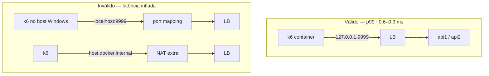
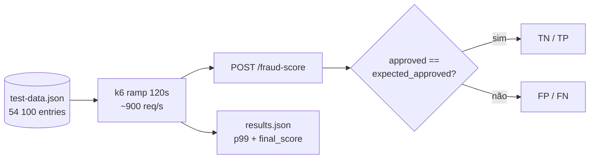
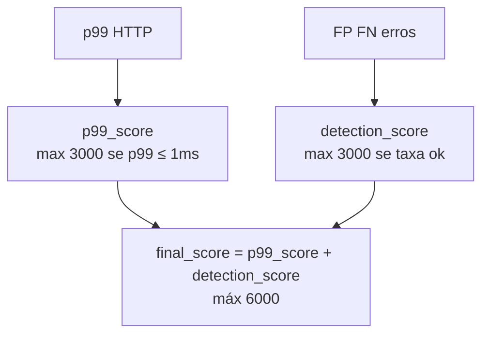
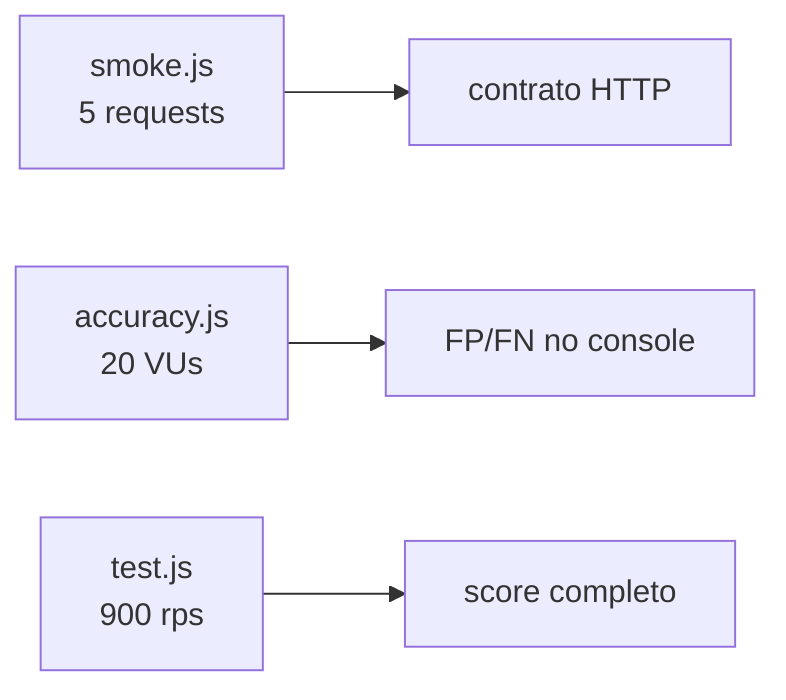
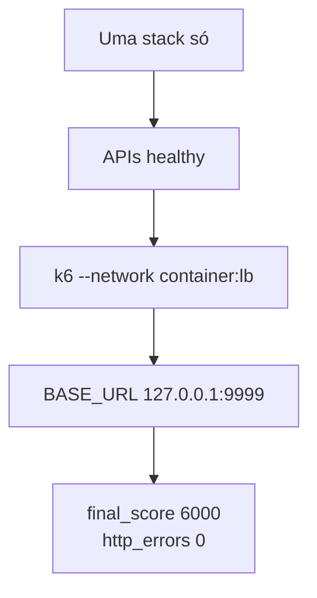

# Testes (k6)

Scripts de carga e pontuação no formato da [Rinha 2026](https://github.com/zanfranceschi/rinha-de-backend-2026).

## Pré-requisito

```bash
# na raiz do repo
docker compose up --build -d
```

Aguarde `api1`, `api2` e `lb` **healthy** e ~30 s de warm-up.

Nome do LB:

```bash
docker ps --format "{{.Names}}" | findstr lb
# ex.: rinha2026-lb-1
```

## Onde rodar o k6

O **p99 só é confiável** se o k6 medir pelo mesmo caminho da prova: dentro da rede do container do LB.



| Modo | p99 típico | Usar? |
|------|------------|-------|
| `--network container:<lb>` + `127.0.0.1:9999` | ~0,6–0,9 ms | **Sim** |
| Rede compose `http://lb:9999` | ~0,8 ms | Aceitável |
| `host.docker.internal:9999` | ~4 ms+ | Não |
| k6 no host + `localhost:9999` | ~70 ms+ | Só smoke |

### Benchmark completo

PowerShell (`test/`):

```powershell
docker run --rm --user root `
  --network container:rinha2026-lb-1 `
  -e BASE_URL=http://127.0.0.1:9999 `
  -v "${PWD}:/test" -w /test `
  grafana/k6:latest run test.js
```

Linux/macOS:

```bash
docker run --rm --user root \
  --network container:rinha2026-lb-1 \
  -e BASE_URL=http://127.0.0.1:9999 \
  -v "$(pwd)/test:/test" -w /test \
  grafana/k6:latest run test.js
```

No Windows use `--user root` para gravar `results.json`.

## O que o `test.js` faz



- Uma iteração por entrada do dataset.
- Métricas: `tp_count`, `tn_count`, `fp_count`, `fn_count`, `error_count`.
- Saída: `test/results.json` (gitignored).

## Pontuação (`final_score`)



| Campo | Significado |
|-------|-------------|
| `final_score: 6000` | p99 ≤ 1 ms + zero falhas ponderadas |
| `p99` | Latência end-to-end no caminho medido |
| `scoring.breakdown` | FP, FN, TP, TN, `http_errors` |

Regras completas: [AVALIACAO.md](https://github.com/zanfranceschi/rinha-de-backend-2026/blob/main/docs/br/AVALIACAO.md).

## Outros scripts



| Arquivo | Uso |
|---------|-----|
| `test.js` | Benchmark oficial + `results.json` |
| `accuracy.js` | Só acurácia no console |
| `smoke.js` | Sanidade após `docker compose up` |
| `body.json` | Payload para `curl` manual |
| `docker-compose.yml` | k6 `host` network (Linux CI) |

```powershell
# smoke
docker run --rm --network container:rinha2026-lb-1 `
  -e BASE_URL=http://127.0.0.1:9999 -v "${PWD}:/test" -w /test `
  grafana/k6:latest run smoke.js

# acurácia
docker run --rm --network container:rinha2026-lb-1 `
  -e BASE_URL=http://127.0.0.1:9999 -v "${PWD}:/test" -w /test `
  grafana/k6:latest run accuracy.js
```

## Checklist



## Problemas comuns

| Sintoma | Causa |
|---------|--------|
| p99 ~70 ms | k6 no host + `localhost` |
| p99 ~4 ms | `host.docker.internal` |
| permission denied | Falta `--user root` (Windows) |
| FP/FN > 0 | Imagem antiga — `docker compose build --no-cache` |
| p99 alto | Duas stacks competindo por CPU |

Backend: [README na raiz](../README.md).
